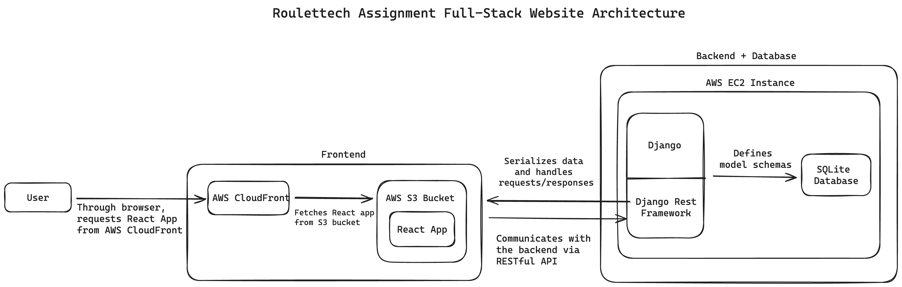

# Architecture Overview


# Installation and Usage

## Demo
[Link](https://drive.google.com/file/d/1HaVrRtmomiElsZgyeBy-d55zdVlbk9y9/view)

## Django + Database Setup
* Create virtual environment: ```python3 -m venv .ven```
* Activate virtual environment: ```. .ven/bin/activate```
* Django: ```pip install django```
* Start Django project: ```django-admin startproject recipes .```
* Run the server: ```python3 manage.py runserver```
* Add *'recipes'* to Apps list in [settings.py]("https://github.com/joshleeman11/Roulettech/blob/main/recipes/settings.py"), create a model in a new [models.py]("https://github.com/joshleeman11/Roulettech/blob/main/recipes/models.py") file, and create and add the table to the database: ```python3 manage.py makemigrations``` && ```python3 manage.py migrate```
* Create a superuser: ```python3 manage.py createsuper```

## Create APIs to communicate between front end and database
* Django Rest Framework (DRF): ```pip install djangorestframework```
* Add *'rest-framework'* to Apps list in [settings.py]("https://github.com/joshleeman11/Roulettech/blob/main/recipes/settings.py")
* Create [serializers.py]("https://github.com/joshleeman11/Roulettech/blob/main/recipes/serializers.py") to create function that converts Python object to JSON
* Create [views.py]("https://github.com/joshleeman11/Roulettech/blob/main/recipes/views.py") that contains all of the API endpoints
* Create [urls.py]("https://github.com/joshleeman11/Roulettech/blob/main/recipes/urls.py") to establish what URLs will hit which endpoints

# API Documentation

1. ```recipes/``` - GET, POST
    > **GET**: Gets all the recipes \
    > **POST**: Adds a recipe
    >> Example JSON: 
        
        {
            name: "Recipe", 
            description: "Tasty", 
            ingredients: ["Eggs", "Rice"]
        }
2. ```recipes/{recipeId}``` - PUT, DELETE
    > **PUT**: Edits a specific recipe \
    >> Example JSON: 
        
        {
            name: "Recipe", 
            description: "Tasty", 
            ingredients: ["Eggs", "Rice"]
        }
    > **DELETE**: Deletes a specific recipe

## React Setup
* I created my React app with ```npx create-react-app <name-of-app>```
* Run app with ```npm start```
* Build app with ```npm run build```

# Features of app

## *Community Recipes*
Every time the page is loaded or a recipe is added or deleted, all the recipes currently available will be listed in the center of the page. 

## Add a recipe
In the top right of the page, enter a name, description, and ingredients. After clicking *Add Recipe*, the newly created recipe could be seen in the main *Community Recipes* list to the left.

## Delete a recipe
In the middle right of the page, enter an id corresponding to a recipe listed in the *Community Recipes*. After clicking *Delete Recipe*, the recipe will be immediately deleted from the *Community Recipes*

## Check what recipe to make with given ingredients
In the bottom right of the page, can click the *+* icon to see a text field where they can enter one ingredient at a time. After clicking *Check*, all the recipes that can be cooked with the ingredients entered will be displayed underneath

## Edit any recipe
To edit any individual recipe, click the *marker* icon on the recipe card and edit the name, description, or ingredients right from the card. After editing, click the *check* icon and your changes will automatically be saved.

# Deployment to AWS
* Create/log into AWS account in console

## Deploying frontend code with AWS S3
* S3 is AWS's simple cloud storage service that allows us to store files in the cloud and host a static website
* Create new S3 bucket that allows public access
* Upload frontend source code
    > Alternatively, after installing *AWS CLI*, I created a *sync* command in [package.json]("https://github.com/joshleeman11/Roulettech/blob/main/myapp/package.json"). ```npm run sync``` will execute ```aws s3 sync ./build 's3://<bucket-name>/'```
* Create bucket policy that allows all the files in the bucket to be accessible over the internet by anyone
* Run ```npm run build``` && ```npm run sync``` whenever I need to push updated code to the live website

## Deploying backend code with AWS EC2

#### Creating EC2 instance
* EC2 is a service provided by AWS that allows us to rent virtual machines in the cloud and run our apps in them as a web server
* I created an EC2 instance with a Ubuntu machine, a Ubuntu Server 24.04, and a t2.micro instance type. 
* I configured the security settings to only allow login from my computer (my IP). I also checked *Allow HTTPS and HTTP traffic from the internet* so the app can be accessed by anyone from anywhere.

#### Connecting to EC2 instance
* ```chmod 400 "<my-key>"``` to ensure my key was not publicly viewable
* ```ssh -i "<my-key>" ubuntu@ec2-54-204-179-85.compute-1.amazonaws.com``` to log into my remote EC2 instance

#### Setup EC2 instance
1. Update system: ```sudo apt-get update```
2. Upgrade system: ```sudo apt-get upgrade```
3. Install necessary packages
    > pip: ```sudo apt install python3-pip``` \
    > django ```sudo apt install python3-django``` \
    > djangorestframework ```sudo apt install python3-djangorestframework```\
    > django-cors-headers \
    ```sudo apt install python3-django-cors-headers```\
    > nginx
    ```sudo apt-get install nginx```
4. Send all local back end source code to EC2 instance to run it remotely instead of locally, while ignoring certain directories and files
    > Send Django app to a *recipes* directory
    ```
    rsync -avz --exclude 'node_modules' --exclude '.git' --exclude '.env' \
    -e "ssh -i ~/.ssh/<my-key>" \
    . ubuntu@ec2-54-204-179-85.compute-1.amazonaws.com:~/recipes
    ```
    > Send *manage.py* to the root directory
    ```
    rsync -avz --exclude 'node_modules' --exclude '.git' --exclude '.env' \
    -e "ssh -i ~/.ssh/<my-key>" \
    ./manage.py ubuntu@ec2-54-204-179-85.compute-1.amazonaws.com:~/
    ```

#### Linking front end code in S3 to back end code in EC2
1. Update *settings.py* in the django app to include \
    ```
    ALLOWED_HOSTS = ['35.153.160.215', 'http://community-recipes.s3-website.us-east-2.amazonaws.com/']
    ```
    This includes both the IP Address of the EC2 instance and the domain name of the S3 bucket to ensure proper communication between the two.
2. Update *settings.py* in the django app to include \
    ```
    CORS_ALLOWED_ORIGINS = [
    'http://community-recipes.s3-website.us-east-2.amazonaws.com',
    'https://community-recipes.s3-website.us-east-2.amazonaws.com']
    ```
    This allows the back end to receive http requests from the front end
3. Correct API_URL on front end to point to EC2 instance \
    ```const API_URL = 'http://35.153.160.215:8000/';```
4. Using *systemd* to create a background service that keeps my Django app running after I close the terminal


## AWS CloudFront for CDN
1. Head to *CloudFront* dashboard in the AWS console
2. Click *Create a CloudFront distribution*
3. Select my s3 bucket as the *origin domain*
4. Select *Origin access control settings* to allow us to make the bucket private while any access to the files must be done through CloudFront
5. Click *Create new OAC*
6. In *Viewer Settings*, select *Redirect HTTP to HTTPS* to enable forwarding and *GET, HEAD, OPTIONS, PUT, POST, PATCH, DELETE* to allow users to manage all features of the app
7. Click *Create distribution*
8. Copy and edit the s3 bucket policy to give CloudFront access to the files and no one else \
    Allow access from http
    ```
    {
        "Sid": "PublicReadGetObject",
        "Effect": "Allow",
        "Principal": "*",
        "Action": "s3:GetObject",
        "Resource": "arn:aws:s3:::community-recipes/*"
    }
    ```
    Allow access from CloudFront
    ```
    {
        "Sid": "AllowCloudFrontServicePrincipalRead",
        "Effect": "Allow",
        "Principal": {
            "Service": "cloudfront.amazonaws.com"
        },
        "Action": "s3:GetObject",
        "Resource": "arn:aws:s3:::community-recipes/*",
        "Condition": {
            "StringEquals": {
                "AWS:SourceArn": "arn:aws:cloudfront::975050060411:distribution/E1NJH4XQB3DRY0"
            }
        }
    }
    

## Update the code that is served over HTTPS and distributed over CloudFront
1. I could just reupload my files to my s3 bucket, but since CloudFront uses caching, I won't see any update for ~24 hours.
2. To update the page immediately , I need to tell my CloudFront distribution that there is an update to the file system and invalidate the caches.
3. In my CloudFront distrubution dashboard, navigate to the *Invalidations* tab and click *Create invalidation*
4. Add ```/*``` as my *Object path* to invalidate all the files 
    > To create a CLI command that'll create an invalidation every time I update my code, I added \
    ```"invalidate": "aws cloudfront create-invalidation --distribution-id E1NJH4XQB3DRY0 --paths '/*'",```

## Creating a custom VPC with one private subnet for EC2

#### Creating custom VPC
1. Head to *VPC dashboard* in the AWS console
2. Click *Create VPC*
3. Select *VPC only*
4. Create a name
5. Add an *IPv4 CIDR* (i.e. 10.0.0.0/16)
6. Click *Create VPC*

#### Creating one private subnet
1. Head to the *Subnets* tab in the *VPC dashboard*
2. Click *Create subnet*
3. Select my previously created custom VPC
4. Create a name
5. Choose *Availability Zone* (I chose *us-east-1a*)
6. Add an *IPv4 subnet CIDR block* (i.e 10.0.1.0/24) (must start with 10.0 to match that of the VPC)
7. Click *Create subnet*

#### Configuring EC2 instance details to be placed into custom VPC
1. Head to the *EC2 dashboard* 
2. Create an AMI from my existing EC2 Instance
    > Select the instance and click on *Actions* > *Image and Templates* > *Create Image*
3. Once the AMI is created, click *Launch instance from AMI* 
4. Create a name
5. Select your key pair name
6. Select the previously created VPC
7. Select the previously created private subnet